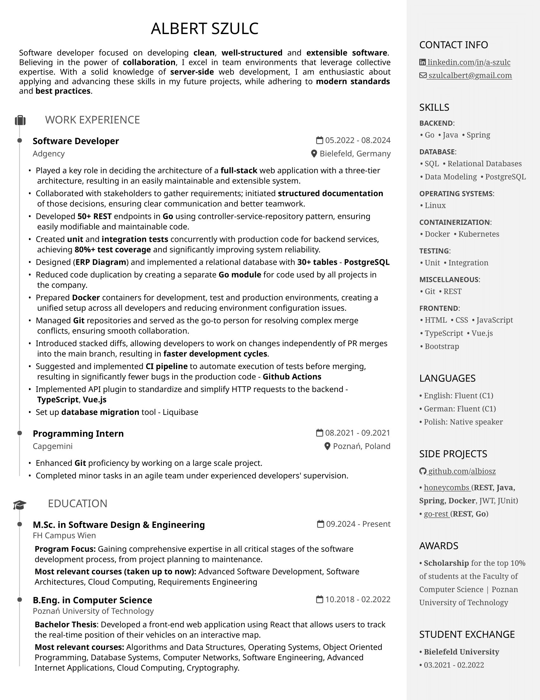

# 🖹 My Resume
A web-based, maintainable resume built using HTML, SCSS, and Mustache.js.

## 💾 Available formats
- [HTML](https://albiosz.github.io/resume)
- [PDF](https://albiosz.github.io/resume/resume.pdf)

## 🎯 Why HTML & CSS for a Resume?
I chose to build my resume with HTML and CSS instead of relying on external tools for several key reasons:

- **Clear Separation of Concerns** - The structure (HTML), styling (CSS) and content (JS) are separated from each other, making updates easier.
- **Enhancing Existing Skills** - Since I work with HTML & CSS regularly, this project allows me to refine my expertise.
- **Flexibility** - Full control over the layout and design, unrestricted by resume builders.
- **Independence from Third-Party Services** - No reliance on third-party tools, ensuring long-term accessibility.

## 🛠️ Tech Stack
- **HTML** - Structured and semantic content.
- **SCSS** - Modular and maintainable styling.
- **Mustache.js** - Template system to eliminate redundant HTML.
